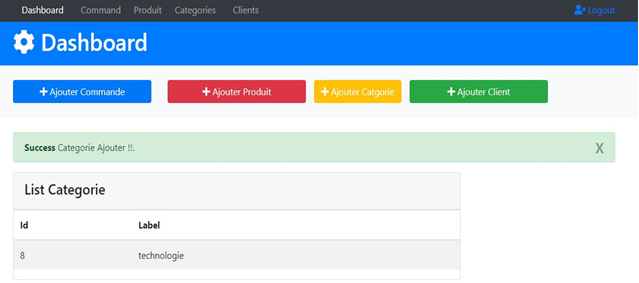
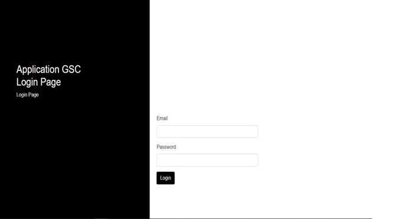

# App for Managing Articles

## Login Page

## 

## Description

- A Java Web Application (3.0) For Adding Pets

#### Fonctionnalites

- Cr Product && Categorie && Client
- Login Page

---

#### Technologies

- Java (JSF/ Hibernate)
- MYSQl
- Bootstrap

---

#### conf

- You Can Configure The Data Base Props : hibernate.cfg.xml

#### Installation

1. Execute gcommande.sql scripte To Create the Data Base
2. Import The Project Or Deploy The war

---

#### Tools

- Eclipse
- Xammp
